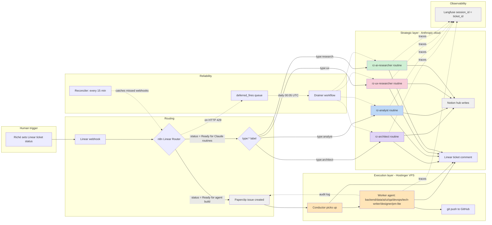

# rz-agent-team

Versioned configuration for Riché's two-layer agent team. Builds and maintains the app portfolio: SIA, [richezamor.com](http://richezamor.com), and 6 prototypes (Recipe Remix, Ploppy, Blocade, Ascend, Trend Analyzer, AI Onboarding).

Authoritative design lives in Notion under [🤖 Agent Team](https://www.notion.so/33eac0ea4f65817eb04eec533c9946f2). This repo is the **deployable artifact** — everything the agents read at runtime.

## Architecture in one paragraph

Two layers, both session-based and human-triggered. **Strategic layer** = 4 Claude Code Routines (Technical Architect, Analyst, User Researcher, AI Researcher) running on Anthropic's cloud; they clone this repo and produce Notion artifacts. **Execution layer** = 10 OpenClaw instances on the Hostinger VPS (Conductor + PM-lite + Designer + Backend + Data + AI + UI + QA + DevOps + Tech Writer) plus `@growth` (narrow-scope exception for feature flags on prototypes). Riché fires work by setting a Linear ticket's status; n8n routes to the appropriate layer based on the `type:*` label.

## Data flow



Key properties:
- The two layers never communicate directly — only through Notion artifacts + Linear ticket state.
- Every LLM call is traced to Langfuse with `session_id = Linear ticket ID` (so all activity for one ticket groups in one Langfuse session).
- The 15/day Max-plan routine cap is handled by n8n's `deferred_fires` queue + daily drainer; no work is lost.
- The reconciler catches dropped Linear webhooks every 15 min by checking Paperclip / Linear-comment evidence of processing.

## Repo layout

```
.
├── .claude-plugin/
│   └── marketplace.json         Marketplace manifest for `claude plugin marketplace add rczamor/rz-agent-team`
├── .claude/
│   └── skills/                  Symlinks so Claude Code Routines auto-discover plugin skills in the cloned repo
├── .github/workflows/
│   └── validate.yml             CI — validates n8n JSON, plugin manifests, marketplace on push + PR
├── plugins/
│   ├── ROUTINE_SETUP.md         Paste-and-configure deploy guide for the 4 routines (CAR-353)
│   ├── rz-architect/            Technical Architect plugin (session + adr-author + integration-design + architecture-review + tech-stack-eval)
│   ├── rz-analyst/              Analyst plugin (session + competitive-matrix + market-analysis + pricing-study + opportunity-brief)
│   ├── rz-ux-researcher/        User Researcher plugin (session + interview-synthesis + persona + journey-map + usability-audit)
│   └── rz-ai-researcher/        AI Researcher plugin (session + method-eval + eval-spec + ablation-study + literature-review)
├── TEAM.md                      Full roster — identical copy on every OpenClaw execution instance
├── USER.md                      Riché's working context + 8-app registry pointers
├── identities/                  One IDENTITY.md per execution agent (10 core + growth)
├── corpus/                      Knowledge corpus seeds for each role (expert distillations)
├── skills/
│   ├── shared/                  Execution-layer skills used by every agent (memory-read, slack-post-hybrid, langfuse-trace, notion-read)
│   └── conductor/               Conductor-specific skills (linear-read, paperclip-create, app-config-load)
├── n8n/
│   ├── linear-router.json       Main router: Linear webhook → routine fire OR Paperclip issue
│   ├── reconciler.json          Every 15 min: catches missed webhooks
│   └── deferred-fire-drainer.json  Daily 00:05 UTC: drains 429-deferred routine fires
├── migrations/                  SQL for `agent_memory` schema (7 tables)
├── scripts/
│   └── agent-team-status.sh     Single-command health report — run on the VPS
├── deploy/                      VPS setup + OpenClaw instance deploy scripts
├── tests/                       Validation helpers for local development
├── connect.sh                   SSH helper for the Hostinger VPS
└── .env.local.example           Template for local connection vars
```

## The two layers

### Strategic layer — 4 Claude Code Routines

Run on Anthropic's cloud under Riché's Max plan (Opus 4.7, 15 runs/day cap). Each routine is backed by a plugin in `plugins/rz-*/`. The plugin's session skill sets persona + operating rules + Langfuse wiring; output skills are focused templates (ADR, competitive matrix, persona, method eval, etc.).

| Routine | Linear label | Notion hub for output |
|---|---|---|
| Technical Architect | `type:architect` | [ADR Log](https://www.notion.so/346ac0ea4f6581d480e4d9633a6cafe6) |
| Analyst | `type:analyst` | [Market & Competitive Analysis](https://www.notion.so/346ac0ea4f6581e7aa23d4ffa30b5de2) |
| User Researcher | `type:ux` | [UX Research Library](https://www.notion.so/346ac0ea4f658139be15f9b3a0002f71) |
| AI Researcher | `type:research` | [AI Research Library](https://www.notion.so/346ac0ea4f658165b27eed3e781ffab4) |

Setup: see [`plugins/ROUTINE_SETUP.md`](plugins/ROUTINE_SETUP.md).

### Execution layer — 10 OpenClaw instances on VPS

Each instance at `/docker/openclaw-{role}/` on the Hostinger VPS (`srv1535988.hstgr.cloud`, 187.124.155.172). Each instance loads 3 files at startup:

- `TEAM.md` — identical across all instances
- `USER.md` — identical across all instances
- `IDENTITY.md` — the role-specific file from `identities/{role}.md`, mounted to the instance's working directory

Plus one Growth exception (`@growth`) for GrowthBook feature flags on prototypes only.

## Two consumer paths for the strategic plugins

Plugins are consumed two different ways. The source of truth is `plugins/<plugin>/skills/<skill>/SKILL.md`; everything else is symlinks or install targets.

| Consumer | How they access the plugin skills |
|---|---|
| Claude Code CLI (local) | `claude plugin install rz-<role>@rz-agent-team` — plugins cached at `~/.claude/plugins/cache/rz-agent-team/rz-<role>/` |
| Claude Code Routines (cloud) | Routine clones this repo at session start; skills are auto-discovered from `.claude/skills/*/SKILL.md` (symlinks to the plugin skills, namespaced `<plugin>-<skill>`) |

## Operating model

- **Session-based, human-triggered.** No 24/7 autonomous operation.
- **Every session targets exactly one app** (`app_id`). Cross-app work splits into sequential sub-sessions.
- **Two-layer orchestration:** Linear is the planning + trigger surface, Paperclip is the execution audit log, n8n bridges them, Conductor dispatches.
- **Three-layer memory (execution):** identity files (static) → Slack channels (live) → Postgres `agent_memory` schema (persistent, `app_id`-partitioned).
- **Strategic routines are stateless between runs.** Continuity comes from Notion hubs.
- **Observability:** Langfuse traces every LLM call, tagged with `session_id` = Linear ticket ID.

Full operating rules: Notion [Operating Rules & Conventions](https://www.notion.so/33eac0ea4f65811680d9d64c1d3080ff).

## Linear triggers

| Status | What fires |
|---|---|
| `Ready for Claude routines` | n8n reads the `type:*` label, POSTs to the matching routine fire URL |
| `Ready for agent build` | n8n creates a Paperclip issue; Conductor picks it up |

`type:*` labels (team-scoped on Career Plan): `architect`, `analyst`, `ux`, `research`, `engineering`, `strategy-decision`.

## Setup prerequisites

1. **Anthropic API key** — not required for the VPS. Claude Code Routines on Max plan handle the 4 strategic routines (Opus 4.7); Conductor escalates to them via Linear tickets and does not call Anthropic directly.
2. **Ollama Cloud API key** — Kimi K2.6 inference for all 10 execution agents including Conductor.
3. **Slack workspace** — bot tokens for the 10 core execution agents + `@growth`.
4. **Linear API token** — workspace access; Conductor + PM-lite need write permission.
5. **GitHub access** — agents work on each app's repo; all 8 already exist at `github.com/rczamor/*`.
6. **Notion API token** — read specs + Strategic Routine Output hubs.
7. **GrowthBook API key** — only for `@growth` (prototypes only).
8. **Langfuse workspace keys** — both execution layer (Postgres-backed) and strategic routines (via SDK env vars).

## Quick-start commands

```bash
# Status check on the VPS
bash scripts/agent-team-status.sh

# Install the strategic plugins locally
claude plugin marketplace add rczamor/rz-agent-team
claude plugin install rz-architect@rz-agent-team
claude plugin install rz-analyst@rz-agent-team
claude plugin install rz-ux-researcher@rz-agent-team
claude plugin install rz-ai-researcher@rz-agent-team

# Validate plugins + manifests
claude plugin validate .                 # marketplace
for p in plugins/rz-*; do
  claude plugin validate "$p"
done
```

## State of the build (2026-04-18)

Completed:
- 10 core OpenClaw instances running on VPS (conductor, pm, designer, backend-eng, data-eng, ai-eng, ui-eng, qa-eng, devops-eng, tech-writer)
- Paperclip, Langfuse, n8n, CloudBeaver, agent_memory Postgres all deployed
- `agent_memory` schema applied (7 tables, app_id-partitioned)
- 4 strategic plugins authored + committed + installed via marketplace
- 6 `type:*` labels in Linear (team-scoped)
- Multi-App Operations + App Registry Notion pages promoted to Approved
- 4 Notion hub pages for strategic routine outputs
- n8n workflows drafted (main router, reconciler, drainer) — committed, not activated
- `openclaw-researcher` retired (role moved to strategic layer)

Awaiting Riché:
- Create 4 Claude Code Routines (see [`plugins/ROUTINE_SETUP.md`](plugins/ROUTINE_SETUP.md))
- Deploy n8n workflows + wire credentials
- Add Linear workflow statuses (`Ready for Claude routines`, `Ready for agent build`)
- Deploy `openclaw-growth` instance (feature-flag agent)
- Execute schema migration (`findings` → `findings_references`)
- Re-register 10-agent org chart in Paperclip

Tracking in Linear: [Agent Team project](https://linear.app/riche-life/project/agent-team-fcdd6aae2334).
